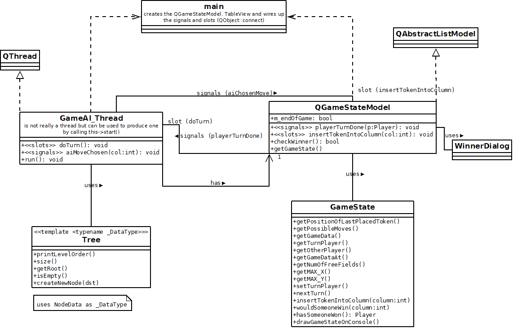
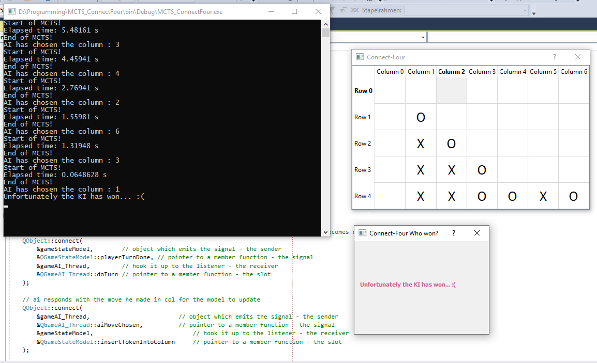

# MCTS_ConnectFour

Implementation of an Connect-Four AI using the MCTS algorithm.

Table of contents
=================

   * [MCTS-Algorithm](#mcts-algorithm)
   * [UML-class diagram](#uml-class-diagram)
   * [GUI-Design](#gui-design)
   * [Installation](#installation)
   * [MIT](#mit)
         
         
## MCTS-Algorithm

The algorithm works by finding the next best move the AI can do.
It does that by book-keeping information about a search tree (here called: game tree). 
The root of that tree is the enemies turn and current state of the board.
The connections from that root to childNodes are the moves the current player can do.

MCTS process:
1. expand all childNodes from the root and assign a very large random initial UCTB-value
2. Repeat an iteration of Selection, Expansion, Simulation and Backpropagation as many times (here set to 10,000, but a time treshold can be chosen too)
3. Select an action to perfom (here: most visited robust childNode from root)

&nbsp;
&nbsp;

Shows what the iteration in step 2. has to do (from wikipedia with CC BY-SA 4.0 licence). 

Steps are explained below:

**Selection:**

The MCTS tries to traverses through the game tree always following paths with highest UCTB - doesn't matter whether enemy nodes or personal ones, because it needs to take into account that the enemy is also tries to maximize its winrate. This traversal stops, when some unexpanded Leaf-Nodes (L) is found.

**Expansion:**

Expand one or more Leaf-Nodes (L), unless leaf-node L ended the game.

**Simulation:**

Simulate a playout until game ended in a WIN / LOOSE / DRAW.

**Backpropagation:**

Increase visit count of every node along the followed path until the root node is reached (included) and do the following for those nodes:
* DRAW => every nodes along the path is increased by Value::DRAW
* WIN => every AI node along the path is increased by Value::WIN, whereas every enemy node is increased by Value::LOOSE
* LOOSE => every AI node along the path is increased by Value::LOOSE, whereas every enemy node is increased by Value::WIN

## UML-class diagram

Shows the class structure and assoziation between the classes used. Including signal and slots for the QT-based GUI.

## GUI-Design
In this project I used a rather simple GUI design consisting of a TableView. When you click in a non-empty column for edit and click somewhere else again, the TableView receives an update and it's going to place your token in that column. When it's not your turn, you cannot place any tokens. The game is stopped when a modal dialog pops up, indicating the winner.

## Sources and Literature

* https://dke.maastrichtuniversity.nl/m.winands/documents/pMCTS.pdf
* https://de.slideshare.net/ftgaic/mcts-ai
* http://jeffbradberry.com/posts/2015/09/intro-to-monte-carlo-tree-search/
* https://en.wikipedia.org/wiki/Monte_Carlo_tree_search

## Installation

- sudo apt-get install libboost-all-dev
- mkdir build bin
- cd build
- cmake ..
- make
- executable and test_executable can be found in bin/

## MIT
### The MIT License
  
